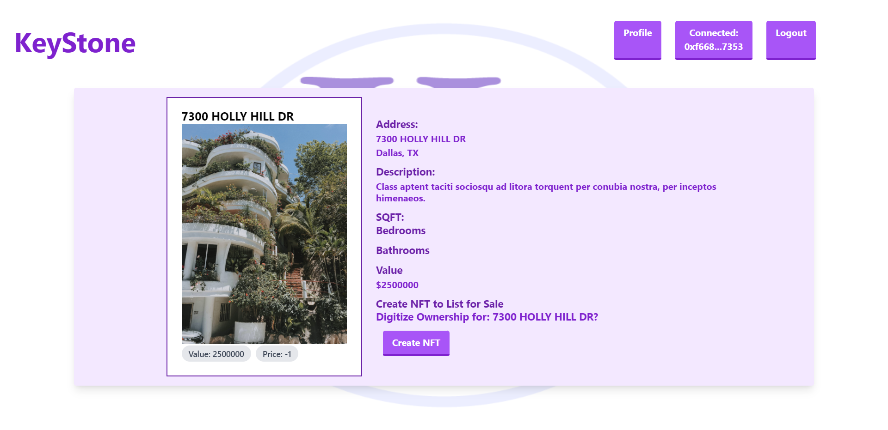

<h1 align="center">Jon Kelly's Keystone Properties's ReadMe</h1>

## About The Project
Welcome to the future of home purchasing. Using web3 technologies Keystone Properties allows users to buy and sell physical properties using NFts as the "deed" that changes hands. Keystone can mint the NFTs locally after ownership has been proven and then allows those homes to be put on the market and purchased using cryptocurrency. Non users can browse the site, but until a wallet is attached will not be able to purchase anything. Keystone even holds the properties and the fund while it is in escrow to ensure both parties will get what they want. 

Link to repo - [https://github.com/J0nK-LE/Keystone](https://github.com/J0nK-LE/Keystone)

[![License][ISC-bdg]][ISC-url]

## Table of Contents

Table of Contents

     <ol>
       <li><a href="#about-the-project">About The Project</a></li>
       <li><a href="#installation">Installation</a></li>
       <li><a href="#usage">Usage</a></li>
       <li><a href="#license">License</a></li>
       <li><a href="#tests">Tests</a></li>
       <li><a href="#questions">Questions</a></li>
     </ol>

## Installation
In your local terminal use "npm i" to install dependencies then run "npm start" which will launch the app in the local browser. 
## Usage
Minting NFTs of property and facilitating the marketplace for property purchase with cryptocurrency
## License
[![License][ISC-bdg]][ISC-url]
## Tests

## Questions
Email - 

GitHub - [https://github.com/J0nK-LE](https://github.com/J0nK-LE)

[MIT-bdg]:https://img.shields.io/badge/License-MIT-yellow.svg
[MIT-url]:https://opensource.org/licenses/MIT
[Apache-bdg]:https://img.shields.io/badge/License-Apache_2.0-blue.svg
[Apache-url]:https://opensource.org/licenses/Apache-2.0
[GNU-bdg]:https://img.shields.io/badge/License-GPLv3-blue.svg
[GNU-url]:https://www.gnu.org/licenses/gpl-3.0
[IBM-bdg]:https://img.shields.io/badge/License-IPL_1.0-blue.svg
[IBM-url]:https://opensource.org/licenses/IPL-1.0
[ISC-bdg]:https://img.shields.io/badge/License-ISC-blue.svg
[ISC-url]:https://opensource.org/licenses/ISC
[Mozilla-bdg]:https://img.shields.io/badge/License-MPL_2.0-brightgreen.svg
[Mozilla-url]:https://opensource.org/licenses/MPL-2.0
